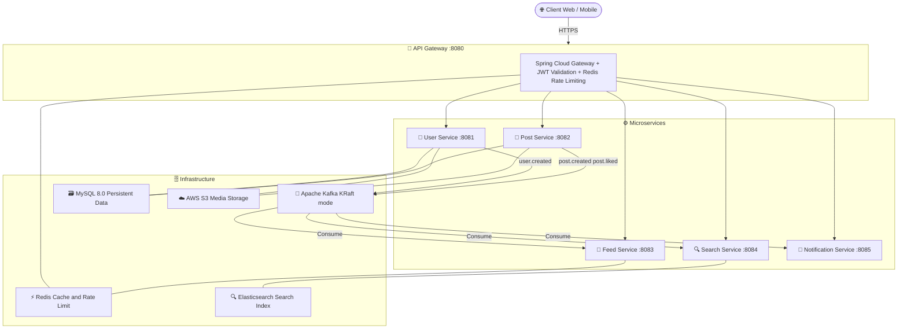
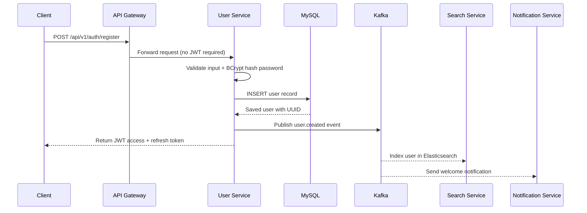
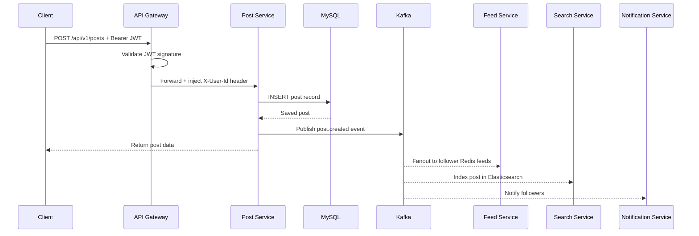

<div align="center">

# 🔗 LinkedIn Microservices

**A production-grade LinkedIn backend clone built with Spring Boot & cloud-native technologies**

[](https://openjdk.org/projects/jdk/17/)
[](https://spring.io/projects/spring-boot)
[](https://kafka.apache.org/)
[](https://www.elastic.co/)
[](https://redis.io/)
[](https://aws.amazon.com/s3/)
[](https://www.mysql.com/)
[](https://www.docker.com/)
[](LICENSE)

</div>

---

## 📖 Introduction

**LinkedIn Microservices** is a production-grade backend system that replicates the core functionality of LinkedIn, built from the ground up using a **microservices architecture**. This project demonstrates real-world software engineering practices including event-driven communication, distributed caching, full-text search, cloud file storage, and centralized authentication.

> 🎯 **Goal**: Showcase how a large-scale social networking platform backend can be built using modern Java & cloud technologies with clean separation of concerns between independent services.

### ✨ Key Features

| Feature | Description |
|---|---|
| 🔐 **Authentication & JWT** | Stateless auth with access & refresh tokens via JJWT |
| 👤 **User Management** | Profile creation, connections, skills, and photo upload |
| 📝 **Post & Feed System** | Create posts, like, comment with real-time Kafka events |
| 🔍 **Full-Text Search** | Elasticsearch-powered people & post search |
| 📡 **Event-Driven Architecture** | Kafka topics for async inter-service communication |
| ⚡ **Caching Layer** | Redis for feed caching and API rate limiting |
| ☁️ **Cloud Storage** | AWS S3 for profile photos and post media |
| 🚪 **API Gateway** | Centralized routing and JWT validation via Spring Cloud Gateway |

---

## 🏗️ System Architecture



### 🔄 Request Lifecycle — User Registration



### 🔄 Request Lifecycle — Post Creation



---

## 📁 Project Structure

```
linkedin-microservices/
├── 📁 api-gateway/              # Spring Cloud Gateway — routing & JWT validation
│   └── src/main/java/com/linkedln/apigateway/
├── 📁 user-service/             # Authentication, user profiles & connections
│   └── src/main/java/com/linkedln/userservice/
│       ├── config/              # AwsConfig, BCryptConfig
│       ├── controller/          # AuthController, UserController
│       ├── dto/                 # Request/Response DTOs
│       ├── entity/              # User, Connection, ConnectionStatus, UserRole
│       ├── repository/          # JPA repositories
│       └── service/             # AuthService, UserService, S3Service
├── 📁 post-service/             # Posts, likes, comments & media
│   └── src/main/java/com/linkedln/postservice/
│       ├── config/              # AwsConfig
│       ├── controller/          # PostController
│       ├── entity/              # Post, Like, Comment
│       ├── repository/          # JPA repositories
│       └── service/             # PostService, S3Service
├── 📁 feed-service/             # Feed aggregation with Redis cache
│   └── src/main/java/com/linkedln/feedservice/
├── 📁 search-service/           # Elasticsearch-powered search
│   └── src/main/java/com/linkedln/searchservice/
├── 📁 notification-service/     # Kafka consumer for notifications
│   └── src/main/java/com/linkedln/notificationservice/
└── 🐳 docker-compose.yml       # Full infrastructure setup
```

---

## 🛠️ Tech Stack

### Backend

| Technology | Version | Purpose |
|---|---|---|
| **Java** | 17 | Core language |
| **Spring Boot** | 4.1.1 | Application framework |
| **Spring Cloud Gateway** | 2025.1.3 | API routing & reverse proxy |
| **Spring Cloud OpenFeign** | 2025.1.3 | Sync inter-service HTTP calls |
| **Spring Data JPA** | — | ORM / database access |
| **Spring Security Crypto** | 7.1.0 | BCrypt password hashing |
| **JJWT** | 0.13.0 | JWT generation & validation |

### Infrastructure & Messaging

| Technology | Version | Purpose |
|---|---|---|
| **Apache Kafka** (KRaft) | 7.4.0 | Event-driven messaging |
| **Redis** | latest | Feed cache & rate limiting |
| **Elasticsearch** | 8.11.0 | Full-text search indexing |
| **MySQL** | 8.0 | Primary relational database |
| **AWS S3 SDK** | 2.47.5 | Media/file cloud storage |

### DevOps & Tooling

| Technology | Purpose |
|---|---|
| **Docker & Docker Compose** | Containerized local development |
| **Lombok** | Boilerplate code reduction |
| **Maven** | Build & dependency management |
| **Spring Boot Actuator** | Health checks & metrics |

---

## ⚙️ Prerequisites

Before you begin, ensure you have the following installed:

| Tool | Version | Link |
|---|---|---|
| **Java JDK** | 17+ | [Download](https://adoptium.net/) |
| **Maven** | 3.8+ | [Download](https://maven.apache.org/download.cgi) |
| **Docker Desktop** | Latest | [Download](https://www.docker.com/products/docker-desktop/) |
| **Git** | Latest | [Download](https://git-scm.com/) |
| **AWS Account** | — | [Sign up](https://aws.amazon.com/) |

---

## 🚀 Installation & Setup

### Step 1 — Clone the Repository

```bash
git clone https://github.com/YOUR_USERNAME/linkedin-microservices.git
cd linkedin-microservices
```

### Step 2 — Start Infrastructure with Docker Compose

```bash
docker-compose up -d
```

Verify all containers are running:

```bash
docker-compose ps
```

### Step 3 — Configure Environment Variables

Create `application.yml` for each service. Example for `user-service`:

**`user-service/src/main/resources/application.yml`**:

```yaml
server:
  port: 8081

spring:
  datasource:
    url: jdbc:mysql://localhost:3306/user_db?createDatabaseIfNotExist=true
    username: root
    password: root
    driver-class-name: com.mysql.cj.jdbc.Driver
  jpa:
    hibernate:
      ddl-auto: update
    show-sql: false
  kafka:
    bootstrap-servers: localhost:9092
    producer:
      key-serializer: org.apache.kafka.common.serialization.StringSerializer
      value-serializer: org.springframework.kafka.support.serializer.JsonSerializer

jwt:
  secret: YOUR_BASE64_ENCODED_SECRET_KEY_MINIMUM_256_BITS
  expiration: 86400000
  refresh-expiration: 604800000

aws:
  region: ap-southeast-1
  s3:
    bucket-name: YOUR_S3_BUCKET_NAME
  credentials:
    access-key: YOUR_AWS_ACCESS_KEY_ID
    secret-key: YOUR_AWS_SECRET_ACCESS_KEY
```

> ⚠️ **Security Warning**: Never commit `application.yml` files with real credentials. Add them to `.gitignore`.

**`post-service/src/main/resources/application.yml`**:

```yaml
server:
  port: 8082
spring:
  datasource:
    url: jdbc:mysql://localhost:3306/post_db?createDatabaseIfNotExist=true
    username: root
    password: root
  kafka:
    bootstrap-servers: localhost:9092
aws:
  region: ap-southeast-1
  s3:
    bucket-name: YOUR_S3_BUCKET_NAME
```

**`feed-service/src/main/resources/application.yml`**:

```yaml
server:
  port: 8083
spring:
  data:
    redis:
      host: localhost
      port: 6379
  kafka:
    bootstrap-servers: localhost:9092
    consumer:
      group-id: feed-service-group
      auto-offset-reset: earliest
```

**`search-service/src/main/resources/application.yml`**:

```yaml
server:
  port: 8084
spring:
  elasticsearch:
    uris: http://localhost:9200
  kafka:
    bootstrap-servers: localhost:9092
    consumer:
      group-id: search-service-group
```

**`notification-service/src/main/resources/application.yml`**:

```yaml
server:
  port: 8085
spring:
  kafka:
    bootstrap-servers: localhost:9092
    consumer:
      group-id: notification-service-group
```

**`api-gateway/src/main/resources/application.yml`**:

```yaml
server:
  port: 8080
spring:
  data:
    redis:
      host: localhost
      port: 6379
  cloud:
    gateway:
      mvc:
        routes:
          - id: user-service
            uri: http://localhost:8081
            predicates:
              - Path=/api/v1/auth/**, /api/v1/users/**
          - id: post-service
            uri: http://localhost:8082
            predicates:
              - Path=/api/v1/posts/**
          - id: feed-service
            uri: http://localhost:8083
            predicates:
              - Path=/api/v1/feed/**
          - id: search-service
            uri: http://localhost:8084
            predicates:
              - Path=/api/v1/search/**
          - id: notification-service
            uri: http://localhost:8085
            predicates:
              - Path=/api/v1/notifications/**
jwt:
  secret: YOUR_BASE64_ENCODED_SECRET_KEY_MINIMUM_256_BITS
```

### Step 4 — Build and Run Each Service

```bash
# Start each service in separate terminals
cd user-service        && ./mvnw spring-boot:run
cd post-service        && ./mvnw spring-boot:run
cd feed-service        && ./mvnw spring-boot:run
cd search-service      && ./mvnw spring-boot:run
cd notification-service && ./mvnw spring-boot:run
cd api-gateway         && ./mvnw spring-boot:run
```

### Step 5 — Verify Health Endpoints

```bash
curl http://localhost:8080/actuator/health   # API Gateway
curl http://localhost:8081/actuator/health   # User Service
curl http://localhost:8082/actuator/health   # Post Service
curl http://localhost:8083/actuator/health   # Feed Service
curl http://localhost:8084/actuator/health   # Search Service
curl http://localhost:8085/actuator/health   # Notification Service
```

---

## 📘 API Usage

### Register a New User

```bash
curl -X POST http://localhost:8080/api/v1/auth/register \
  -H "Content-Type: application/json" \
  -d '{
    "firstName": "John",
    "lastName": "Doe",
    "email": "john.doe@example.com",
    "password": "SecurePass123!",
    "headline": "Senior Software Engineer",
    "location": "Ho Chi Minh City, Vietnam"
  }'
```

**Response:**

```json
{
  "userId": "550e8400-e29b-41d4-a716-446655440000",
  "email": "john.doe@example.com",
  "firstName": "John",
  "lastName": "Doe",
  "accessToken": "eyJhbGciOiJIUzI1NiJ9...",
  "refreshToken": "eyJhbGciOiJIUzI1NiJ9..."
}
```

### Login

```bash
curl -X POST http://localhost:8080/api/v1/auth/login \
  -H "Content-Type: application/json" \
  -d '{
    "email": "john.doe@example.com",
    "password": "SecurePass123!"
  }'
```

### Create a Post

```bash
curl -X POST http://localhost:8080/api/v1/posts \
  -H "Content-Type: application/json" \
  -H "Authorization: Bearer YOUR_ACCESS_TOKEN" \
  -d '{"content": "Excited to share my new microservices project! 🚀"}'
```

### Search Users/Posts

```bash
curl "http://localhost:8080/api/v1/search?q=software+engineer&type=people" \
  -H "Authorization: Bearer YOUR_ACCESS_TOKEN"
```

### Get Personalized Feed

```bash
curl http://localhost:8080/api/v1/feed \
  -H "Authorization: Bearer YOUR_ACCESS_TOKEN"
```

---

## 🔑 Kafka Topics Reference

| Topic | Producer | Consumers | Description |
|---|---|---|---|
| `user.created` | User Service | Search, Notification | New user registered |
| `post.created` | Post Service | Feed, Search, Notification | New post published |
| `post.liked` | Post Service | Notification | Post received a like |
| `connection.requested` | User Service | Notification | Connection request sent |

---

## 🏛️ Architecture Deep Dive

### API Gateway

The only publicly exposed service on port `8080`. Responsibilities:
- **JWT Validation**: Validates every request except `/auth/**`. Extracts `userId` and injects it as `X-User-Id` header for downstream services.
- **Rate Limiting**: Uses Redis sorted sets to enforce per-user request limits.
- **Routing**: Path-based routing to appropriate microservices using Spring Cloud Gateway MVC.

### User Service

Two main domains:
1. **Authentication** (`AuthService`): BCrypt password hashing, JWT issuance (access: 24h, refresh: 7 days), publishes `user.created` to Kafka.
2. **Social Graph** (`Connection`): LinkedIn-style connection requests with `PENDING → CONNECTED` state machine.
3. **Media**: Profile photo & cover upload via AWS SDK v2 S3Service.

### Post Service

Core content engine:
- Posts stored in MySQL, linked to `authorId` (microservice data isolation — no cross-service JOINs).
- `Like` and `Comment` entities with denormalized counts for fast reads.
- All write operations publish Kafka events for downstream fan-out.

### Feed Service

Implements **Fanout-on-Write** pattern:
- Listens to `post.created` Kafka events.
- Fans out to every follower's Redis sorted set (score = timestamp).
- Feed reads are pure Redis cache hits — zero database queries at read time.
- Uses OpenFeign to call User Service for follower list resolution.

### Search Service

- Consumes `user.created` and `post.created` Kafka events.
- Indexes documents into Elasticsearch with full-text search capability.
- Supports fuzzy matching on names, headlines, skills, and post content.

### Notification Service

- Pure Kafka consumer — stateless and horizontally scalable.
- Processes all domain events asynchronously to deliver notifications.

---

## 🔧 Troubleshooting

| Problem | Solution |
|---|---|
| `Connection refused: localhost:9092` | Run `docker-compose up -d` |
| `Access denied for MySQL` | Wait for container to be healthy: `docker ps` |
| `JWT signature does not match` | Ensure all services share the exact same `jwt.secret` |
| Elasticsearch not indexing | Check health: `curl http://localhost:9200/_cluster/health` |
| Redis connection failed | Verify: `docker exec -it redis redis-cli ping` |

---

## 🤝 Contributing

1. Fork the repository
2. Create your feature branch: `git checkout -b feature/amazing-feature`
3. Commit your changes: `git commit -m 'feat: add amazing feature'`
4. Push to the branch: `git push origin feature/amazing-feature`
5. Open a Pull Request

---

## 📄 License

This project is licensed under the **MIT License** — see the [LICENSE](LICENSE) file for details.

---

<div align="center">

Made with ❤️ by **Lam Minh Phuc**

⭐ Star this repo if you find it helpful!

</div>
